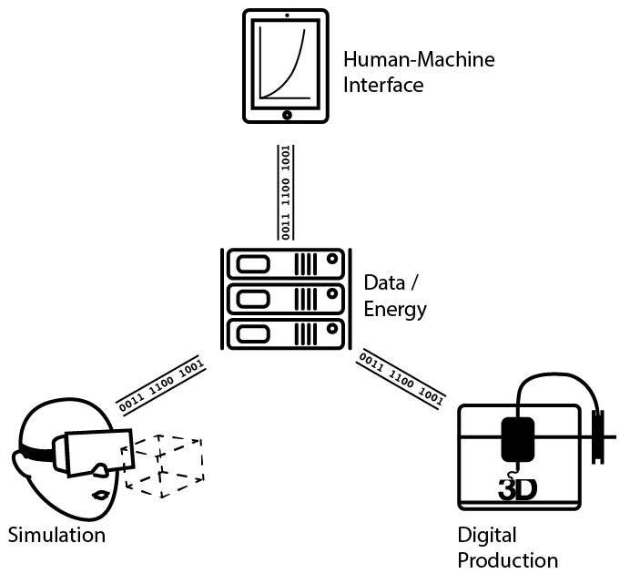

# ISAC@OTH-AW
Industry Software Application Center

ISAC@OTH-AW - Industry Software Application Center. The interdisciplinary project ISAC@OTH-AW of the Ostbayeriche Technische Hochschule Amberg-Weiden was aimed to make the advantages of the industry 4.0 accessible to medium-sized companies.

The project had a duration of six years and was funded with a sum of 2.6 million Euros by the Bavarian Ministry of Economic Affairs and Media, Energy and Technology.

The project consists of four sub-projects. The subprojects provide a part of their results on this page for free use to the public.

## Sub-Projects

1. [Development of an expert system for the evaluation and further development of innovative manufacturing processes and materials](p1/)

3. [Development of methods to increase efficiency in model creation for the digital factory](p2/)

3. [Industry 4.0 with cost-effective real-time Ethernet and small controls](p3/)

4. [Development of new types of user concepts for controlling and monitoring digital production](p4/)

[Homepage](https://www.isac-oth.de/) | [Contact](mailto:isac-kontakt@oth-aw.de)

