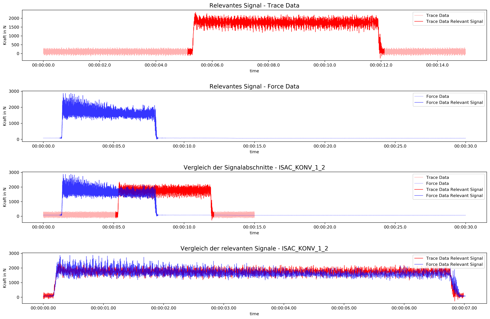
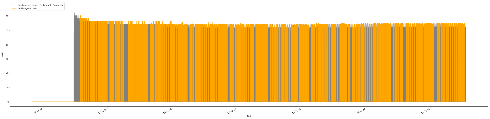
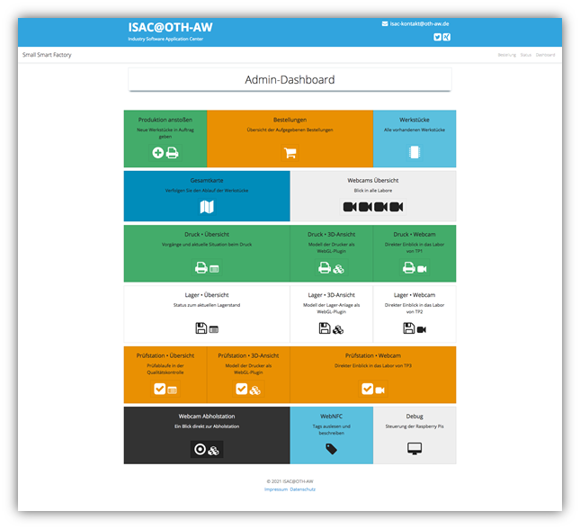
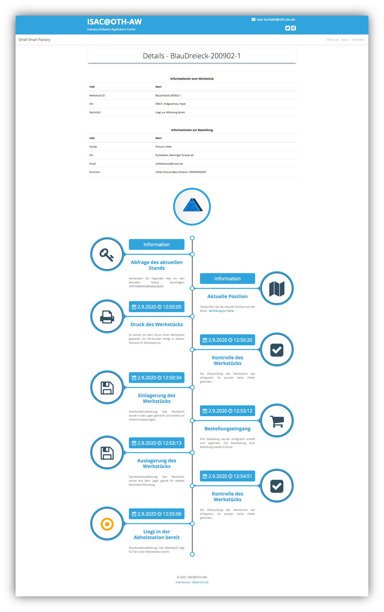

# Demonstrator
Mithilfe eines Demonstrators wurde innerhalb des Forschungsprojekts ISAC die Überwachung und Steuerung von Industrieanlagen umgesetzt. Dabei sollen dem Endanwender, unabhängig seines aktuellen Standortes, Informationen und Kennziffern zum System präsentiert werden. Dies kann mit einer klassischen Website oder innerhalb einer WebGL-Anwendung, in der ein 3D-Modell der Maschine angezeigt wird, durch einen digitalen Zwilling ermöglicht werden.

Innerhalb dieses Repository werden die einzelnen Komponenten dieses Demonstrators vorgestellt. Diese bauen dabei jeweils auf einem Docker-Image auf. Zur Verwendung der Anwendung ist dementsprechend eine aktuelle Version von [Docker](https://www.docker.com/) notwendig.

## Start der Anwendung

Nach dem Start von Docker kann mithilfe des folgenden Befehls innerhalb dieses Verzeichnisses der Demonstrator gestartet werden. Dieser ist anschließend unter http://localhost:3000/ erreichbar. Der initiale Start benötigt mit erstmaligen Download der Images einige Zeit (ca. 10 Minuten oder deutlich mehr, abhängig von der Performance des Systems), da viele Pakete erst heruntergeladen und automatisch konfiguriert werden müssen.

```
docker-compose down && docker-compose build && docker-compose up
```

## Komponenten

Die Konfiguration der einzelnen Komponenten und der dazugehörigen Docker Images ist in der Datei **docker-compose.yml** möglich.
Der Demonstrator ist in mehrere Komponenten aufgeteilt. Dabei wurden einige Docker Images erweitert und befinden sich im Ordner **/images** :

### jupyter-notebooks
Stellt einen Jupyter-Server zur Verfügung, mit dem die in diesem Teilprojekt durchgeführten Analysen eingesehen werden können.

Aufruf:
- http://localhost:8888/

#### **Virtuelle Kraftsensorik**

Ziel war es, durch eine Berechnung der Trace-Daten einer Fräsmaschine – über mehrere Versuche hinweg –  aufzuzeigen, dass die auftretenden Kräfte virtuell abbildbar sind. Hintergrund ist der Versuch, aufwändige und teure Messsensorik durch eigens gemessener Daten der Verarbeitungmaschinen einzusparen. Die Untersuchung stellt eine erste Proof-Off-Konzept-Studie dar.

Aufruf:

- [Aufruf Readme](http://localhost:8888/notebooks/projects/force-trace-analysis/Readme.ipynb)
- [Aufruf Notebook](http://localhost:8888/notebooks/projects/force-trace-analysis/notebooks/data_compare/Presentation.ipynb)

force_trace.png

#### **Analyse des Stromverbrauch anhand Sensordatensätzen**

Ziel ist es, aus den Förderbanddatensätze des Teilprojekts 2. eine Datenanalyse  durchzuführen. Dabei stand ein Analyse der Werkstückträger und des Stromverbrauchs aus den Sensordatensätzen im Vordergrund. Grundsätzlich wurden dabei nach Optimierungsmöglichkeiten gesucht.

Inhalt:
- Analyse der Sensordaten
- Analyse der Performance des Förderbandes
- Leistungsverbrauch / Leistungsersparnis
- Diverse Kennzahlen

Aufruf:
- [Aufruf Readme](http://localhost:8888/notebooks/projects/transport-module-power-analysis/Readme.ipynb)
- [Aufruf Notebook](http://localhost:8888/notebooks/projects/transport-module-power-analysis/notebooks/data_compare/Analyze_Unnecessary_Worktime.ipynb)

force_trace.png

### jupyter-notebooks-server
Stellt einen Jupyter-Server zur Verfügung, der als API konfiguriert worden ist. Dadurch ist es möglich, mithilfe eines Jupyter-Notebooks auf Datensätze zugreifen zu können. Die Algorithmen der in *jupyter-notebooks* erstellten Notebooks können dadurch wiederverwendet und für weitere Komponenten integriert werden. Beispielsweise wurde die Sensordaten des Lagers aufbereitet und ausgewertet und können im Node.js Server eingebunden werden.

Anfragen an die API werden dabei an http://localhost:8898/ gesendet.

### mongo-seeder
Zuständig für die initiale Befüllung der Datenbank (MongoDB) mit innerhalb des Forschungsprojektes erhobenen Daten.

### node-frontend-backend
Node.js Webserver, der für die Anzeige des Demonstrators verwendet wird. Ist zuständig für die Kommunikation mit den OPC UA Servern sowie für das Ausliefern der für den Client benötigten Webseiten. Dabei wurde eine Trennung zwischen Backend (Ordner backend) und Frontend (Ordner src) durchgeführt. Statisch benötigte Dateien, wie auch die WebGL Anwendungen befinden sich im Ordner public. Die Vermittlung von Anfragen über eine WebSocket-Schnittstelle an einen OPC UA Server wurde im Ordner backend/proxy implementiert.

Aufruf:
- http://localhost:3000/

In einem Administrationsdashboard kann für jede Station eine einzelne Ansicht gewählt werden und es können die standortspezifischen Daten angezeigt werden:



Status einer Bestellung:



#### Steuerung der virtuellen Werkstücke

Im Normalbetrieb des Forschungsprojektes wurden mithilfe von Raspberry Pis das Ankommen oder Abgehen von Werkstücken erfasst. Für die komplette digitale Simulation wurde innerhalb des Admin-Dashboards die Möglichkeit eingebaut, diese Raspberry Pis zu simulieren.

Aufruf:
- http://localhost:3000/admin/debug

### python-opcua-tp1-server-1 / 2
Die 3D-Drucker innerhalb des Systems simulieren den Druckvorgang mithilfe von auf Python basierenden OPC UA Servern. Für dieses System wurde eine Simulation dazu erstellt, damit keine Abhängigkeit zu einer realen physischen Maschine existiert, mit der der aktuelle Druckfortschritt angezeigt werden kann. 

Aufruf (beispielsweise mit einem externen Viewer):
- opc.tcp://localhost:4840/opcua/server/
- opc.tcp://localhost:4841/opcua/server/

### python-opcua-tp2-server
Das Lager verwaltet die aktuellen Lagerplätze für die im System vorhandenen Werkstücke. Für dieses System wurde eine Simulation dazu erstellt, damit keine Abhängigkeit zu einer realen physischen Maschine existiert.

Aufruf (beispielsweise mit einem externen Viewer):
- opc.tcp://localhost:4845/opcua/server/