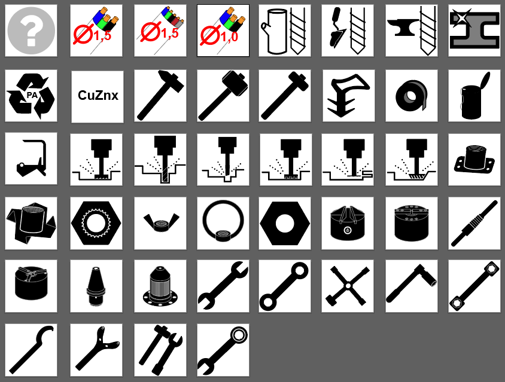
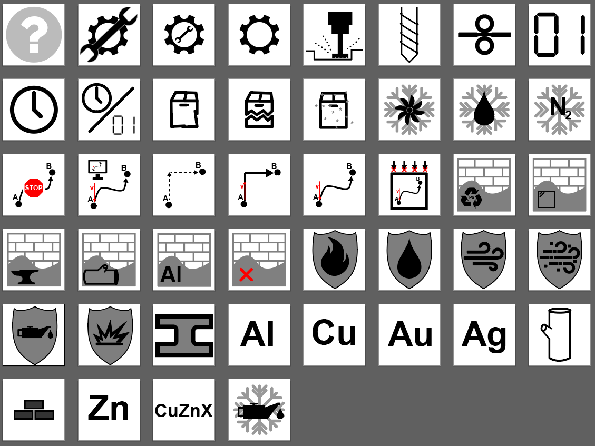
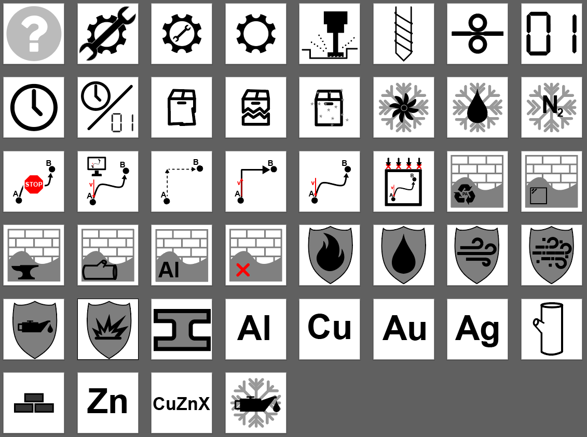

# Iconset für Industrie-Kategorien

Für die Umsetzung des ISAC-Demonstrators war es notwendig sich mit dem Design von Bedienelementen zu beschäftigen. Für die Kartenanwendungen haben wir eigene Iconsets erstellt, die für bestimmte Werkzeuge und Material-Typen nutzbar sind. Für die Entwicklung eines Alpha-Prototypen wurden Daten aus der Yelp-Data-Set-Challenge anhand von Restaurant-Daten genommen und die Namen und Kategorien umbenannt, passend dazu wurde nach aktuellem Stand bestmögliche grafische Repräsentationen entwickelt[1](#myfootnote1) [2](#myfootnote2) [3](#myfootnote3).

Die fiktiven Testdaten wurden für drei Kategorien umgeschrieben, es gab drei Varianten: 

* Lagerstandorte mit verschiedensten Werkzeugen
* Maschinen mit unterschiedlichen Eigenschaften 
* Produkte, die verschiedene Eigenschaften tragen

Zu den unterschiedlichen Kategorien wurden dann entsprechende Icon-Sets entwickelt.

## Lagerstandorte mit verschiedensten Werkzeugen

### Liste an Kategorien

|    # | name                   | display_name                | icon_path                           |
| ---: | ---------------------- | --------------------------- | ----------------------------------- |
|    1 | wood_drill             | Holzbohrer                  | drill_bits-wood_drill               |
|    2 | concrete_drill         | Betonbohrer                 | drill_bits--concrete_drill          |
|    3 | metal_drill            | Metallbohrer                | drill_bits-metal_drill              |
|    4 | 3x1,5                  | 3x1,5                       | cables-3x1_5                        |
|    5 | 5x1,5                  | 5x1,5                       | cables-5x1_5                        |
|    6 | 3x1,0                  | 3x1,0                       | cables-3x1_0                        |
|    7 | stainless_steel        | Edelstahl                   | materials-stainless_steel           |
|    8 | brass                  | Messing                     | materials-brass                     |
|    9 | polyamide              | Polyamid                    | materials-polyamide                 |
|   10 | engineers_hammer       | Schlosserhammer             | hammers-engineers_hammer            |
|   11 | rubber_mallet          | Gummihammer                 | hammers-rubber_mallet               |
|   12 | sledgehammer           | Vorschlaghammer             | hammers-sledgehammer                |
|   14 | pipe_sealing_tape      | Gewindedichtband            | seals-pipe_sealing_tape             |
|   15 | pipe_sealing_cord      | Gewindedichtfaden           | seals-pipe_sealing_cord             |
|   16 | radial_shaft_seals     | Wellendichtringe            | seals-radial_shaft_seals            |
|   17 | plain_cutter           | Walzenfräser                | millingheads-plain_cutter           |
|   18 | cotter_mill            | Langlochfräser              | millingheads-cotter_mill            |
|   19 | end_mill               | Schaftfräser                | millingheads-end_mill               |
|   20 | t_slot_cutter          | T-Nuten-Fräser              | millingheads-t_slot_cutter          |
|   21 | slitting_cutter        | Schlitzfräser               | millingheads-slitting_cutter        |
|   22 | angular_milling_cutter | Winkelfräser                | millingheads-angular_milling_cutter |
|   23 | welding_nuts           | Anschweißmuttern            | nuts-welding_nuts                   |
|   24 | drive_in_nuts          | Einschlagmuttern            | nuts-drive_in_nuts                  |
|   25 | press_nuts             | Einpressmuttern             | nuts-press_nuts                     |
|   26 | wing_nuts              | Flügelmuttern               | nuts-wing_nuts                      |
|   27 | ring_nuts              | Ringmuttern                 | nuts-ring_nuts                      |
|   28 | hexagon_nuts           | Sechskantmuttern            | nuts-hexagon_nuts                   |
|   29 | hydro_centering_chuck  | Hydrozentspanner            | hydro_centering_chuck               |
|   30 | 3_jaw_power_chuck      | Dreibacken-Kraftspannfutter | three_jaw_power_chuck               |
|   31 | cartridge_mandrel      | Hülsenspanndorne            | cradridge_mandrel                   |
|   32 | sliding_jaw_mandrel    | Gleitbackendorne            | slidung_jaw_madrel                  |
|   33 | hydraulic_chuck        | Hydraulisches Spannfutter   | hydraulic_chuck                     |
|   34 | mechanical_chuck       | Mechanisches Spannfutter    | mechanical_chuck                    |
|   35 | open_jaw_wrench        | Maulschlüssel               | wrenches-open_jaw_wrench            |
|   36 | ring_wrench            | Ringschlüssel               | wrenches-ring_wrench                |
|   37 | pipe_wrench            | Rohrschlüssel               | wrenches-pipe_wrench                |
|   38 | socket_wrench          | Steckschlüssel              | wrenches-socket_wrench              |
|   39 | dumbbell_wrench        | Zehnlochschlüssel           | wrenches-dumbbell_wrench            |
|   40 | hook_wrench            | Hakenschlüssel              | wrenches-hook_wrench                |
|   41 | face_pin_wrench        | Stirnlochschlüssel          | wrenches-face_pin_wrench            |
|   42 | striking_face_wrench   | Schlag-Maulschlüssel        | wrenches-striking_face_pin          |
|   43 | ratchet_ring_spanner   | Ratschenringschlüssel       | wrenches-ratchet_ring_wrench        |
|   44 | profile_seal           | Profildichtung              | seals-profile_seal                  |

### Beispiel Icons

## Maschinen mit unterschiedlichen Eigenschaften 

### Liste an Kategorien

|    # | name                   | display_name          | icon_path                         |
| ---: | ---------------------- | --------------------- | --------------------------------- |
|    1 | manual                 | Manuell               | mode-manual                       |
|    2 | semi_automatic         | Halbautomatik         | mode-semi_automatic               |
|    3 | fully_automatic        | Vollautomatik         | mode-fully-automatic              |
|    4 | milling_maschine       | Fräsen                | operation_milling_maschine        |
|    5 | drill                  | Bohrer                | operation-drill                   |
|    6 | rolling_mill           | Walze                 | operation-rolling-mill            |
|    7 | digital                | digital               | data-digital                      |
|    8 | analog                 | analog                | data-analog                       |
|    9 | dual                   | dual                  | data-dual                         |
|   10 | used                   | Gebraucht             | condition-used                    |
|   11 | damaged                | beschädigt            | condition-used                    |
|   12 | new                    | Neu                   | condition-new                     |
|   14 | air_cooling            | Luftkühlung           | cooling-air_cooling               |
|   15 | water_cooling          | Wasserkühlung         | cooling-water_cooling             |
|   16 | nitrogen_cooling       | Stickstoffkühlung     | cooling-nitrogen_cooling          |
|   17 | holding_member_control | Haltegliedsteuerung   | control-holding_member_control    |
|   18 | programm_control       | Programmsteuerung     | control-program_control           |
|   19 | positioning_control    | Punktsteuerung        | control-point_control             |
|   20 | line_motion_control    | Streckensteurung      | control-distance_control          |
|   21 | contouring             | Bahnsteuerung         | control-contouring                |
|   22 | managment_control      | Führungssteuerung     | control-management_control        |
|   23 | plastic_cladding       | Plastikverkleidung    | cladding-plastic_cladding         |
|   24 | glas_cladding          | Glasverkleidung       | cladding-glas-cladding            |
|   25 | metal_cladding         | Metallverkleidung     | cladding-metal_cladding           |
|   26 | wood_cladding          | Holzverkleidung       | cladding-wood-cladding            |
|   27 | alluminium_cladding    | Alluminiumverkleidung | cladding-alluminium_cladding      |
|   28 | no_cladding            | keine Verkleidung     | cladding-no_cladding              |
|   29 | fire_protection        | Feuerschutz           | protection-fire_protection        |
|   30 | water_protection       | Wasserschutz          | protection-water_protection       |
|   31 | wind_protection        | Windschutz            | protection-wind_protection        |
|   32 | dust_protection        | Staubschutz           | protection-dust_protection        |
|   33 | lubricating_protection | Schmierschutz         | protection-lubricating_protection |
|   34 | explosive_protection   | Explosionsschutz      | protection-explosive_protection   |
|   35 | steel                  | Stahl                 | material_in_use-steel             |
|   36 | alluminium             | Alluminium            | material_in_use-aluminium         |
|   37 | copper                 | Kuper                 | material_in_use-cooper            |
|   38 | gold                   | Gold                  | material_in_use-gold              |
|   39 | silver                 | Silber                | material_in_use-silver            |
|   40 | wood                   | Holz                  | material_in_use-wood              |
|   41 | stone                  | Stein                 | material_in_use-stone             |
|   42 | zinc                   | Zink                  | material_in_use-zinc              |
|   43 | brass                  | Messing               | material_in_use-brass             |
|   44 | oil_cooling            | Ölkühlung             | cooling-oil-cooling               |

### Beispiel Icons

## Produkte, die verschiedene Eigenschaften tragen

### Liste an Kategorien

|    # | name                   | display_name          | icon_path           |
| ---: | ---------------------- | --------------------- | ------------------- |
|    1 | manual                 | Manuell               | attire-casual       |
|    2 | semi_automatic         | Halbautomatik         | attire-dressy       |
|    3 | fully_automatic        | Vollautomatik         | attire-formal       |
|    4 | milling_maschine       | Fräsen                | wifi-yes            |
|    5 | drill                  | Bohrer                | wifi-no             |
|    6 | rolling_mill           | Walze                 | wifi-paid           |
|    7 | digital                | digital               | smoking-no          |
|    8 | analog                 | analog                | smoking-outdoor     |
|    9 | dual                   | dual                  | smoking-yes         |
|   10 | used                   | Gebraucht             | byob-no             |
|   11 | damaged                | beschädigt            | byob-yes-corkage    |
|   12 | new                    | Neu                   | byob-free           |
|   14 | air_cooling            | Luftkühlung           | ages-19plus         |
|   15 | water_cooling          | Wasserkühlung         | ages-21plus         |
|   16 | nitrogen_cooling       | Stickstoffkühlung     | ages-all            |
|   17 | holding_member_control | Haltegliedsteuerung   | music-background    |
|   18 | programm_control       | Programmsteuerung     | music-dj            |
|   19 | positioning_control    | Punktsteuerung        | music-jukebox       |
|   20 | line_motion_control    | Streckensteurung      | music-karaoke       |
|   21 | contouring             | Bahnsteuerung         | music-live          |
|   22 | managment_control      | Führungssteuerung     | music-video         |
|   23 | plastic_cladding       | Plastikverkleidung    | goodfor-breakfast   |
|   24 | glas_cladding          | Glasverkleidung       | goodfor-brunch      |
|   25 | metal_cladding         | Metallverkleidung     | goodfor-dessert     |
|   26 | wood_cladding          | Holzverkleidung       | goodfor-dinner      |
|   27 | alluminium_cladding    | Alluminiumverkleidung | goodfor-latenight   |
|   28 | no_cladding            | keine Verkleidung     | goodfor-lunch       |
|   29 | fire_protection        | Feuerschutz           | diet-dairyfree      |
|   30 | water_protection       | Wasserschutz          | diet-glutenfree     |
|   31 | wind_protection        | Windschutz            | diet-halal          |
|   32 | dust_protection        | Staubschutz           | diet-koscher        |
|   33 | lubricating_protection | Schmierschutz         | diet-soyfree-veggie |
|   34 | explosive_protection   | Explosionsschutz      | diet-vegan          |
|   35 | steel                  | Stahl                 | ambience-casual     |
|   36 | alluminium             | Alluminium            | ambience-classy     |
|   37 | copper                 | Kuper                 | ambience-divey      |
|   38 | gold                   | Gold                  | ambience-hipster    |
|   39 | silver                 | Silber                | ambience-intimate   |
|   40 | wood                   | Holz                  | ambience-romantic   |
|   41 | stone                  | Stein                 | ambience-touristy   |
|   42 | zinc                   | Zink                  | ambience-trendy     |
|   43 | brass                  | Messing               | ambience-upscale    |
|   44 | oil_cooling            | Ölkühlung             | ages-18plus         |

### Beispiel Icons

## Icon-Dateien

Die fertigen PNG Icons finden sich im Ordner [→ PNG](/png)

Die editierbaren Verktorgrafiken finden sich im Ordner [→ Verctor](/vector)

###### Verweise

<a name="myfootnote1">[1]</a>: R. Abdullah, R. Hübner, R. Cziwerny, and D. H. Wilson, *Pictograms, Icons & Signs: A Guide to Information Graphics*. Thames & Hudson, 2006.

<a name="myfootnote2">[2]</a>: C. Designs, *Icon Design Sketchbook with Icons Grid: Design and Sketch Icon Ideas Using Ready Grids from Notebook*. Amazon Digital Services LLC - Kdp Print Us, 2019.

<a name="myfootnote3">[3]</a>: F. Sockwell and E. Potts, *Icons: Entwicklung und Design visueller Symbole*. Stiebner, 2018.
